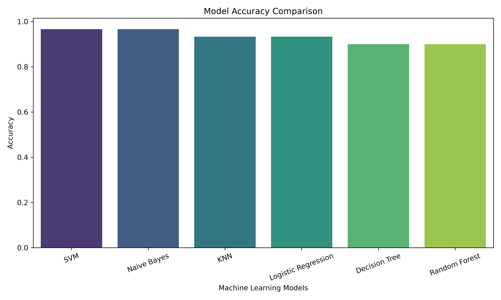
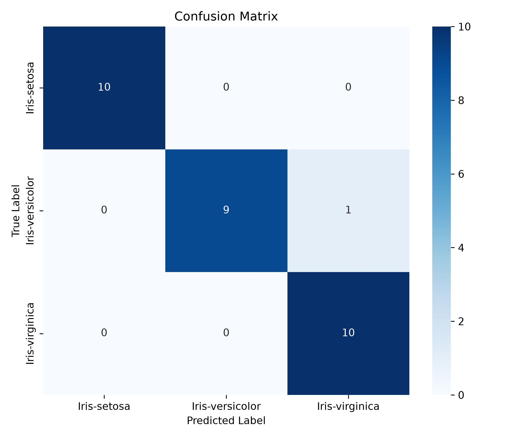

# 🌸 Iris Flower Species Classification

<div align="center">


### 🌼 End-to-End Machine Learning Project | CodeAlpha Data Science Internship - Task 1

Predict the species of an Iris flower using Machine Learning with an interactive Streamlit dashboard.

</div>

---

# 📌 Project Overview

The **Iris Flower Species Classification** project is an end-to-end Machine Learning application that classifies an Iris flower into one of three species based on its physical measurements.

The application provides a modern Streamlit dashboard where users can enter flower measurements, receive instant predictions, visualize prediction confidence, and explore model performance.

This project demonstrates the complete machine learning workflow including:

- Data preprocessing
- Exploratory Data Analysis (EDA)
- Model training
- Model evaluation
- Prediction
- Web application deployment

---

# 🌼 Iris Species

The classifier predicts one of the following species:

- 🌸 Iris Setosa
- 🌿 Iris Versicolor
- 🌺 Iris Virginica

---

# 🚀 Features

### ✅ Machine Learning

- Data Cleaning
- Feature Scaling
- Label Encoding
- Train-Test Split
- Multiple ML Algorithms
- Automatic Best Model Selection
- Model Serialization using Joblib

---

### 📊 Exploratory Data Analysis

- Dataset Overview
- Missing Value Analysis
- Statistical Summary
- Species Distribution
- Histograms
- Pair Plot
- Correlation Heatmap
- Boxplots

---

### 🤖 Machine Learning Models

The following classification models were trained and compared:

- Logistic Regression
- Decision Tree
- Random Forest
- Support Vector Machine (SVM)
- K-Nearest Neighbors
- Gaussian Naive Bayes

---

### 📈 Evaluation Metrics

The trained models were evaluated using:

- Accuracy
- Precision
- Recall
- F1-Score
- Classification Report
- Confusion Matrix

---

### 🌐 Streamlit Dashboard

The application includes:

- Modern Dashboard UI
- Responsive Layout
- Sidebar Information Panel
- Interactive Input Sliders
- Prediction Card
- Prediction Confidence
- Probability Distribution
- Species Information Cards
- Dataset Information
- Model Performance Dashboard

---

# 🖼️ Application Preview

## Prediction Dashboard

> Add your application screenshot here.

```
images/dashboard.JPG
images/dashboard1.JPG
```

---

## 📈 Model Performance

| Accuracy Comparison | Confusion Matrix |
|---------------------|------------------|
|  |  |

# 📂 Project Structure

```text
CodeAlpha_IrisFlowerClassification
│
├── app.py
├── requirements.txt
├── README.md
├── .gitignore
│
├── data
│   └── Iris.csv
│
├── images
│   ├── accuracy_comparison.png
│   ├── confusion_matrix.png
│   ├── heatmap.png
│   ├── histograms.png
│   ├── pairplot.png
│   └── species_distribution.png
│
├── models
│   ├── iris_model.pkl
│   ├── scaler.pkl
│   └── label_encoder.pkl
│
├── notebooks
│   └── iris_analysis.ipynb
│
└── src
    ├── data_preprocessing.py
    ├── model_training.py
    ├── evaluate_model.py
    └── predict.py
```

---

# ⚙️ Workflow

```text
Dataset
   │
   ▼
Data Preprocessing
   │
   ▼
Exploratory Data Analysis
   │
   ▼
Feature Scaling
   │
   ▼
Train Multiple Models
   │
   ▼
Evaluate Models
   │
   ▼
Select Best Model
   │
   ▼
Save Model (.pkl)
   │
   ▼
Prediction Module
   │
   ▼
Streamlit Dashboard
```

---

# 🧠 Technologies Used

| Category | Technologies |
|----------|--------------|
| Programming Language | Python |
| Machine Learning | Scikit-Learn |
| Data Analysis | Pandas, NumPy |
| Data Visualization | Matplotlib, Seaborn |
| Web Framework | Streamlit |
| Model Serialization | Joblib |
| Development | VS Code |
| Version Control | Git & GitHub |

---

# 📊 Dataset

Dataset Used:

**Iris Flower Dataset**

Features:

- Sepal Length
- Sepal Width
- Petal Length
- Petal Width

Target:

- Iris Setosa
- Iris Versicolor
- Iris Virginica

---

# 📈 Model Performance

The application compares multiple machine learning algorithms and automatically selects the best-performing model.

Evaluation Metrics:

- Accuracy
- Precision
- Recall
- F1 Score
- Confusion Matrix

---

# 💻 Installation

Clone the repository

```bash
git clone https://github.com/keerthanc-25/CodeAlpha_IrisFlowerClassification.git
```

Move inside the project

```bash
cd CodeAlpha_IrisFlowerClassification
```

Create virtual environment

```bash
python -m venv .venv
```

Activate

Windows

```bash
.venv\Scripts\activate
```

Linux / macOS

```bash
source .venv/bin/activate
```

Install dependencies

```bash
pip install -r requirements.txt
```

---

# ▶️ Run the Application

Run Streamlit

```bash
streamlit run app.py
```

---

# 📷 Output

The application predicts:

- Predicted Iris Species
- Prediction Confidence
- Probability Distribution
- Species Information
- Model Performance
- Dataset Information

---

# 🌍 Deployment

The project can be deployed on:

- Streamlit Community Cloud
- Render
- Hugging Face Spaces

---

# 🎯 Future Enhancements

- Database Integration (SQLite/MySQL)
- Prediction History
- User Authentication
- Model Explainability (SHAP/LIME)
- Docker Containerization
- CI/CD Pipeline
- Cloud Deployment
- REST API using FastAPI

---

# 📚 Learning Outcomes

This project demonstrates practical knowledge of:

- Machine Learning Workflow
- Data Preprocessing
- Feature Engineering
- Model Selection
- Model Evaluation
- Model Deployment
- Streamlit Development
- Git & GitHub
- End-to-End ML Pipeline

---

# 🤝 Acknowledgements

- CodeAlpha Data Science Internship
- Scikit-Learn Documentation
- Streamlit Documentation
- UCI Machine Learning Repository

---

# 👨‍💻 Developer

**Keerthan C**

Artificial Intelligence & Machine Learning

# 🌐 Deployment

<div align="center">

### 🚀 Live Streamlit Application

🔗 **Click here to use the application**

👉 **(https://code-alpha-iris-flower-classification-model.streamlit.app/)**

---

### 📂 GitHub Repository

💻 **https://github.com/keerthanc-25/CodeAlpha_IrisFlowerClassification**

</div>
⭐ If you found this project useful, consider giving it a star!

Made with ❤️ using Python, Scikit-Learn and Streamlit

</div>
